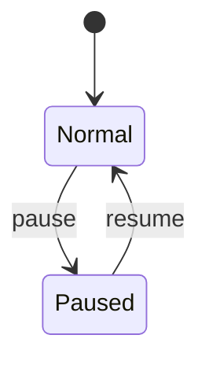

# State Machines（状态机/状态约束）

本仓库包含若干“状态字段”，它们影响 UI 展示、可执行操作与后台行为。这里以“可复刻”为目标，对关键状态机做抽象描述。

---

## 1) 用户状态（sys_user.status）

来源：`02_Data/ENTITIES.md`（`sys_user.status` 字段注释）

### States

| State | 含义 | 进入条件 | 退出条件 |
| --- | --- | --- | --- |
| `0` | 正常 | 创建用户默认正常 / 启用操作 | 被停用 |
| `1` | 停用 | 管理端停用用户 | 重新启用 |

### 行为约束

- 登录校验：停用用户禁止登录（`LoginService.authenticate_user` 会抛出 `LoginException`）。

---

## 2) 定时任务状态（sys_job.status）

来源：`ruoyi-fastapi-backend/sql/ruoyi-fastapi.sql`（`sys_job.status` 注释：`0正常 1暂停`）

### States

| State | 含义 | 进入条件 | 退出条件 |
| --- | --- | --- | --- |
| `0` | 正常 | 创建/启用任务 | 暂停 |
| `1` | 暂停 | 暂停任务 | 恢复/启用任务 |

### Transitions（抽象）

### Side Effects

- 任务加载：
  - 启动时会从 DB 读取任务列表并注册到 scheduler（见 `config/get_scheduler.py:init_system_scheduler`）
- “执行一次”：
  - 某些动作会在任务暂停时也可执行一次（scheduler 内有特殊 trigger 处理）

---

## 3) 账号锁定状态（Redis 临时状态）

该状态不落 DB，而由 Redis 维护（防爆破/风控）。

### States

| State | 存储位置 | 含义 |
| --- | --- | --- |
| unlocked | 无 key 或 key 过期 | 可尝试登录 |
| locked | `ACCOUNT_LOCK:{username}` | 账号被锁定（10 分钟） |

### Transition

- `unlocked` → `locked`：
  - 触发：10 分钟内密码错误次数 > 阈值（默认 5）
- `locked` → `unlocked`：
  - 触发：Redis key 过期或手动解锁接口

> 复刻时需保持：阈值、计数 key、锁定 key、过期时间与错误提示一致，否则会影响 E2E 与前端提示行为。
