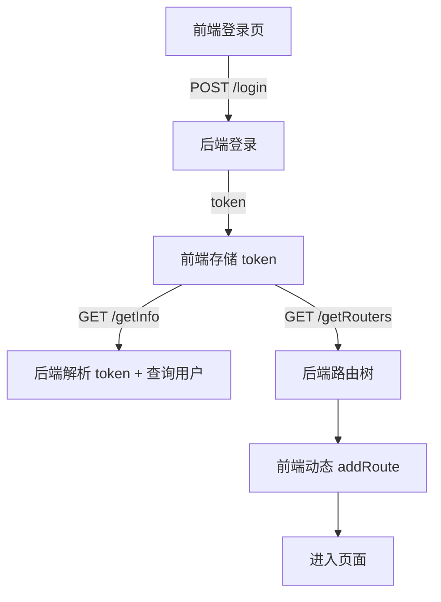

# Workflows（关键流程）

本文件描述“跨模块/跨系统”的关键流程，用于复刻时对齐用户体验与系统行为。

---

## 1) Workflow：登录 → 获取用户信息 → 动态路由

### Purpose

用户完成登录后，前端获取用户信息与路由树，并动态注册可访问路由。

### Trigger

用户在 `ruoyi-fastapi-frontend/src/views/login.vue` 提交登录表单。

### Steps

1) **Login（后端）**
   - Input：用户名/密码/验证码（可选）/uuid/login_info
   - Action：校验账号、生成 JWT、写入 Redis 在线 token
   - Output：`token`（统一响应结构或 OAuth2 结构）
   - On Error：返回 `failure`（code=601）或 `unauthorized/forbidden`

2) **GetInfo（后端）**
   - Input：Authorization Bearer token
   - Action：JWT decode + Redis 在线态校验 + DB 查询用户信息/角色/权限
   - Output：`CurrentUserModel`（含 roles/permissions/avatar 等）

3) **GetRouters（后端）**
   - Input：当前用户
   - Action：生成用户可见菜单/路由树（RBAC + perms）
   - Output：`RouterModel[]`

4) **GenerateRoutes（前端）**
   - Input：用户 roles/permissions + router tree
   - Action：生成 `accessRoutes` 并 `router.addRoute` 动态注册
   - Output：用户进入目标页面（或重定向到首页）

### Flow Diagram

---

## 2) Workflow：服务启动（DB/Redis/Scheduler 初始化）

### Purpose

确保系统启动后具备：DB 连接、Redis 连接、字典/参数缓存预热、定时任务加载。

### Trigger

后端启动（`create_app()` 生命周期）。

### Steps（简化）

1) `Base.metadata.create_all`（保底建表）
2) Redis 连接池建立与 ping
3) 字典/参数缓存预热
4) APScheduler 启动并加载 DB 中任务（注册 listener）

---

## 3) Workflow：代码生成（导入 → 编辑 → 预览 → 删除）

### Purpose

从业务表元信息生成前后端代码（提供 UI 操作与下载）。

### Trigger

用户进入 `工具 / 代码生成` 页面，执行导入与生成操作。

### Verification

E2E 关键流程已在 `ruoyi-fastapi-test/tool/test_code_gen.py` 覆盖：
- 确保导入 `sys_post` 表 → 编辑 → 预览 → 删除可成功完成并清理环境

